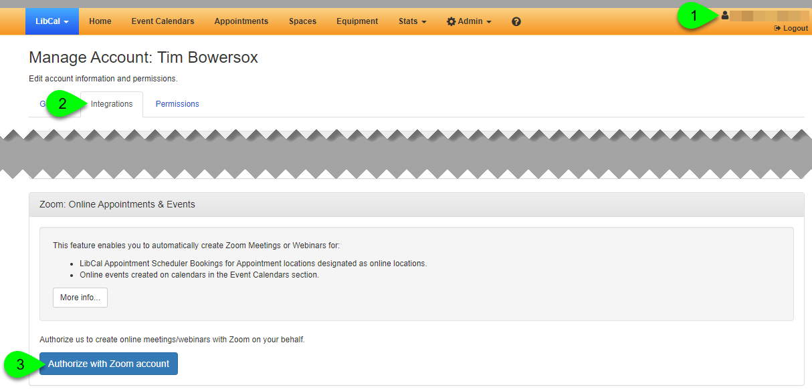
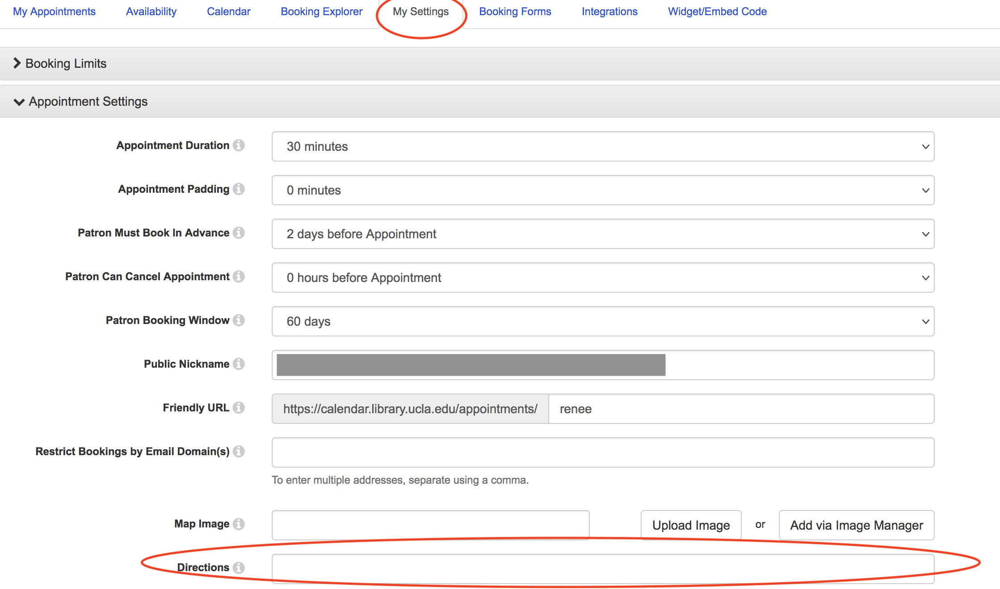
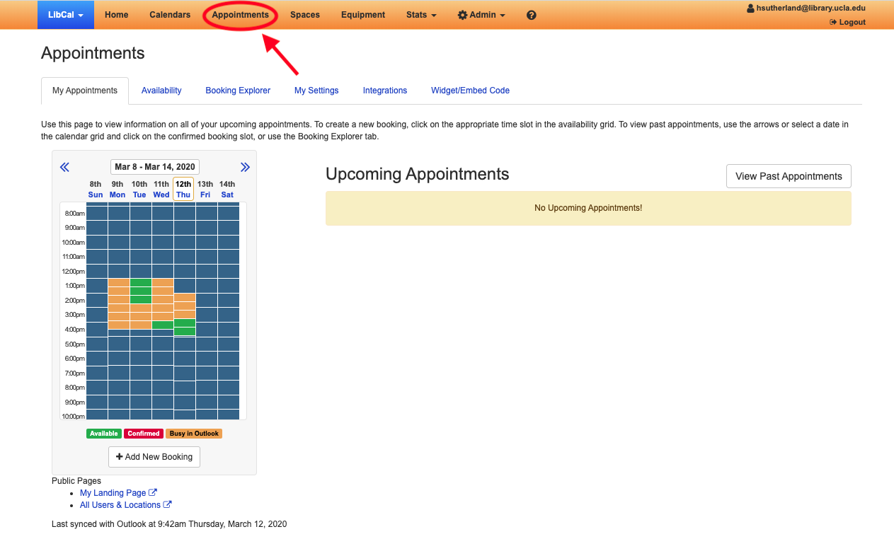
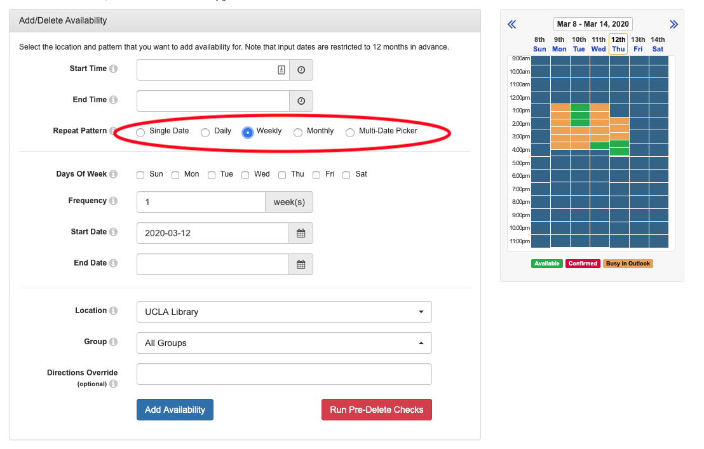
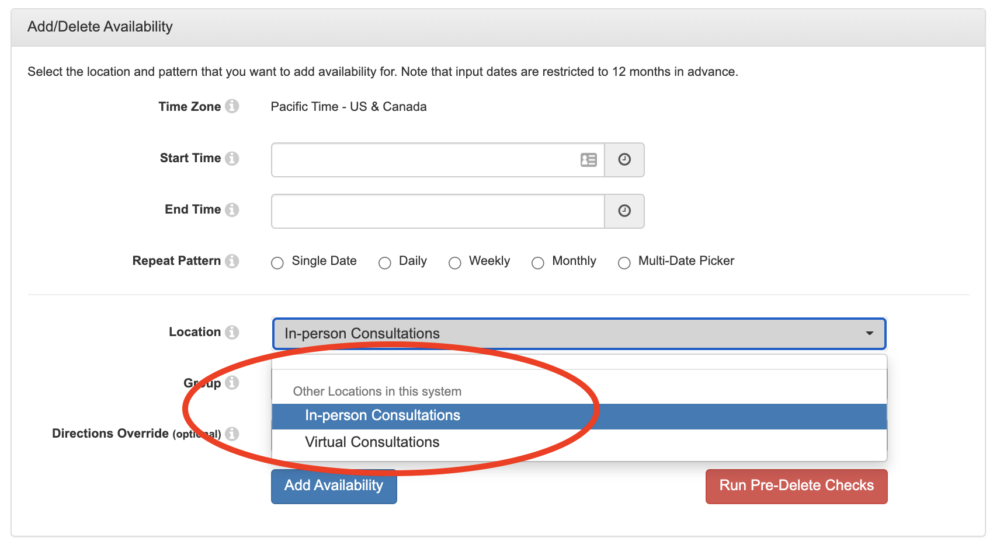

# DataSquad LibCal Setup Checklist (Students)

This checklist must be completed before you begin taking DataSquad appointments.

## Before You Start

You will need:

* Your UCLA account
* A UCLA Zoom account
* The calendar you actually use (Outlook or Google)

Your LibCal account was created for you by the LibCal admin.

## Step 1: Accept Your LibCal Account Invitation

Check your UCLA email for a message from **LibCal / Springshare**.

The subject line may look like:

* “You’ve been added to LibCal”
* “LibCal account created”

Open the email and click the accept or activate link. When prompted, log in with your UCLA credentials.

If you do not accept this invitation:

* You may be able to log in
* But you will not see Appointments or Availability

If you do not see the email, check spam or “Other” folders. If the link has expired, contact your supervisor to have it resent.

To confirm the invitation worked:

* Go to [https://calendar.library.ucla.edu/admin/appointments](https://calendar.library.ucla.edu/admin/appointments)
* Log in
* Click **Appointments**

You should see Availability, My Settings, Booking Forms, and Integrations. If you do not, stop and flag it.

## Step 2: Log In and Confirm Access

After accepting the invitation, log in at
[https://calendar.library.ucla.edu/admin/appointments](https://calendar.library.ucla.edu/admin/appointments)

Click **Appointments** in the top navigation.

Confirm you can see Availability, My Settings, Booking Forms, and Integrations. If you cannot, do not proceed.

## Step 3: Connect Zoom (Required)

This integration ensures that Zoom meetings are automatically created for your appointments and included in confirmation emails.

1.  Open LibCal.
2.  Click on the user icon (next to your email address) in the top right hand corner.
    
3.  Click on the "Integrations" tab.
4.  In the "Zoom: Online Appointments and Events" section, click the "Authorize with Zoom account" button.
5.  On the next page, click the "Sign in with SSO" button.
6.  On the next page, enter "ucla" in the field.
7.  On the UCLA SSO page, enter your credentials and complete the multi-factor authentication process.
8.  After authenticating, click the "Authorize" button on the page that appears.
9.  You will return to the LibCal website.

**Verification:**
Once connected, Zoom meetings will be auto-generated for appointments. You do *not* need to paste Zoom links manually.

To verify the integration is working for emails:
1. Go to **Appointments** > **My Settings**.
2. Scroll to **Confirmation Email to Patron**.
3. Replace the existing text with the **Standard DataSquad Email Template** below to ensure Zoom links are sent correctly:

```html

<p>Hi {{FIRST_NAME}},</p>
<p>Thanks for booking an appointment with the Data Science Center.</p>
<p>We will be meeting via Zoom. You can join the meeting using the link below:</p>
<p><strong>Join Zoom Meeting:</strong> {{{ONLINE_JOIN_URL}}}</p>
<p><strong>Password:</strong> {{{ONLINE_JOIN_PASSWORD}}}</p>
<p>If you have any questions before our meeting, please reply to this email.</p>
<p>Best regards,<br>
{{NAME}}</p>

```
4. Click **Save**.

## Step 4: Connect Your Calendar

In **Appointments → Integrations**, connect the calendar you use.

If you use Outlook:

* Confirm your UCLA Outlook account is authorized
* Select a calendar
* Enable “Check Outlook/Exchange Unavailable Times”

LibCal will block busy times automatically.

If you use Google Calendar:

* Confirm LibCal is pushing appointments to Google Calendar
* Do not assume unavailable times are blocked

Publish conservative availability.

## Step 5: Select the Required Booking Form

All DataSquad appointments must use the shared intake form.

Form name: **DSC/DataSquad**
Form ID: **19099**

To set it:

* Go to **Appointments → My Settings**
* Find Appointment Form
* Select **DSC/DataSquad (19099)**

* Save

Do not create your own booking form.

## Step 6: Set Your Availability

Go to **Appointments → Availability**.


Use Weekly availability and start with limited blocks. You can always add more later.


Think of availability as office hours, not your full schedule.

When setting availability:

* Use Virtual Consultations for Zoom meetings
* Use In-Person Consultations only if you know the location
* Create separate availability blocks if you offer both




## Step 7: Review Settings Once

In **My Settings**, confirm:

* Appointment length
* Padding between appointments
* How far in advance people can book
* Cancellation window

Do this before publishing a lot of availability.

## Step 8: Sanity Check

Before sharing your booking link:

* Book a test appointment with yourself
* Confirm it appears on your calendar
* Confirm Zoom is created
* Confirm intake questions appear

If something looks wrong, check Availability first, then Integrations.

## Ongoing Expectations

Update availability when your schedule changes.  
Do not publish your entire week.  
Do not create new booking forms.  
Flag conflicts early so appointments can be reassigned.
